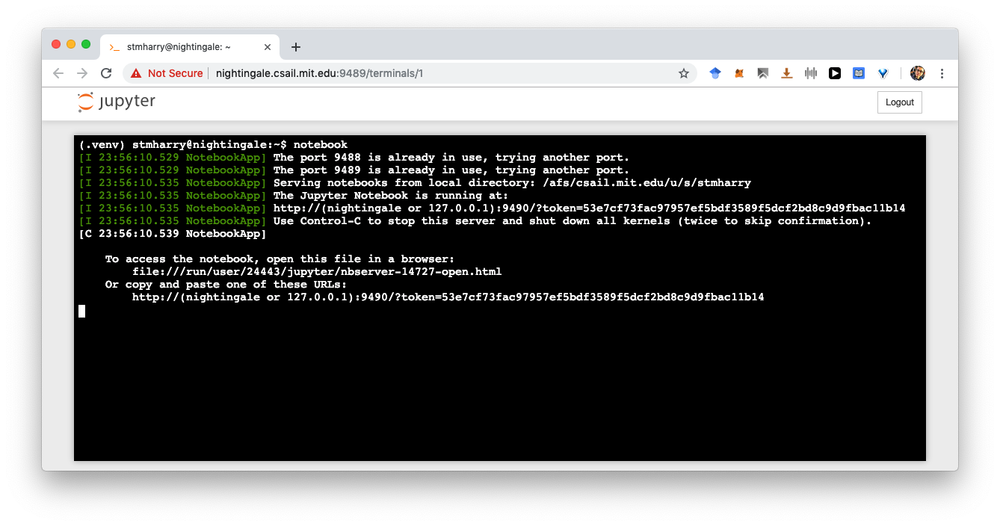
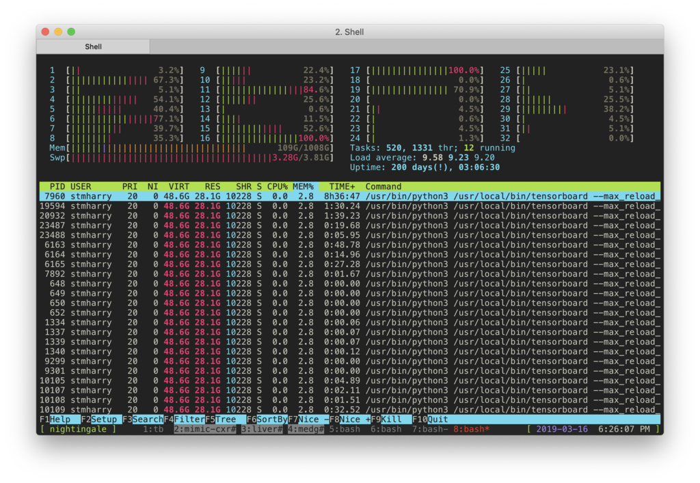
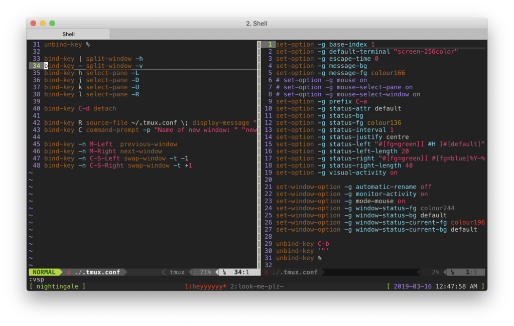
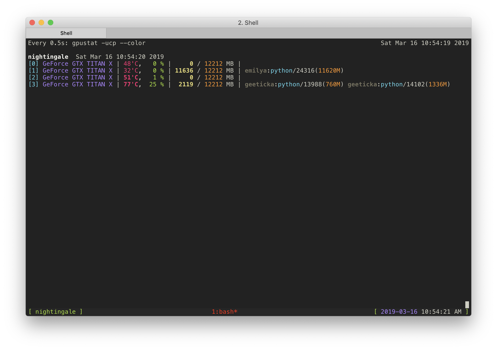
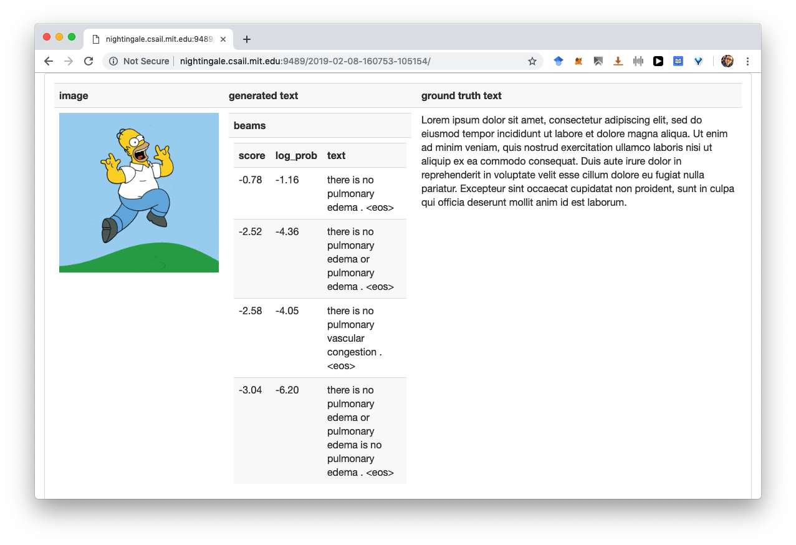
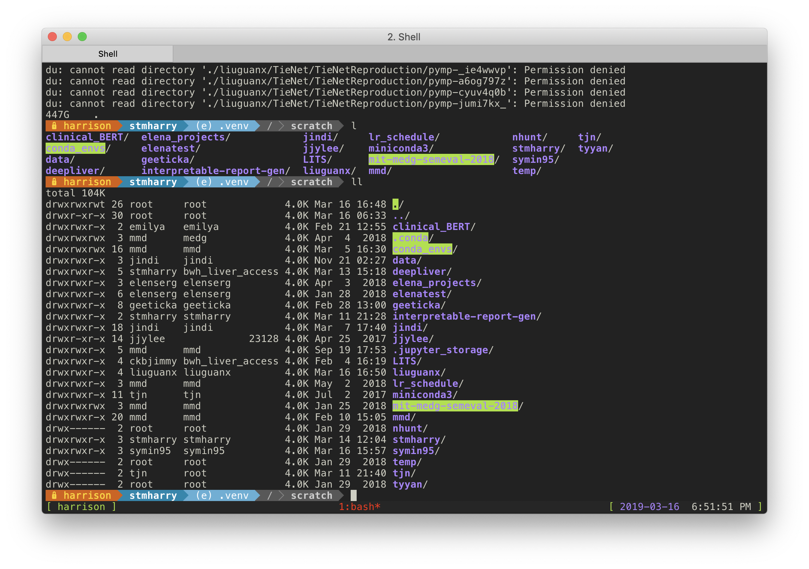

# How to Work with Computers


---

## Overview

- Local
    - [Terminal](#terminal)
- Interface
    - [Mobile shell](#mobile-shell-mosh) (`mosh`, no more `ssh`!)
    - [Jupyter notebook](#jupyter-notebook)

---

- Remote
    - Software
        - [Bourne Shell (`bash`)](#bourne-shell-bash)
        - [Terminal Multiplexer (`tmux`)](#terminal-multiplexer-tmux-and-longtmux)
        - [Anaconda (`conda`)](#anaconda-conda)
        - [`pip`](#pip)
    - Hardware
        - [GPU](#gpu-very-important)
        - [Hard Disk](#hard-disk)
- [Case Study](#case-study)
    - [Starting a Project](#starting-a-project)
    - [Harry's Setup](#harrys-setup)

---

## Terminal

- Grab a good terminal application! (I personally use iTerm2 for Mac)
- Grab a good font! (I personally use Meslo 13pt)
- Grab a good screen!

---

## Mobile Shell (`mosh`)

Ever feel frustrated when

- you have to reconnect to the server every time your computer wakes up?
- it lags while you are on tethered internet/airplane WiFi?

#### No sweat!

```bash
local~$ mosh $MY_ID@nightingale.csail.mit.edu
```

---

## Jupyter Notebook

Ever feel frustrated when

- you have to remember every argument to properly start notebook?
- you have to copy the port over to browser?
- you get
    ```bash
    /usr/bin/xdg-open: 778: /usr/bin/xdg-open: iceweasel: not found
    /usr/bin/xdg-open: 778: /usr/bin/xdg-open: seamonkey: not found
    ...
    ```

#### No sweat!

```bash
# remote:~/.bashrc
alias notebook="jupyter notebook --ip 0.0.0.0 --port $MY_FAV_PORT --no-browser"
```

and always go to `http://nightingale.csail.mit.edu:$MY_FAV_PORT`.

---

#### Did you know there's a terminal interface?



---

## Bourne Shell (`bash`)

Ever feel frustrated when

- there is not a default virtual environment when you log in?
- always having to type `nvidia-smi` for `nvidia-smi`?

---

#### No sweat!

Just add aliases and startup scripts to `~/.bashrc`!

```bash
# remote:~/.bashrc
if (tty -s); then
    source activate $MY_CONDA_PATH
fi

alias smi="nvidia-smi"
```

---

#### Notes
Some very useful command

- `htop`: monitors basically everything, from CPU load, memory, to process IDs



---

## Terminal Multiplexer (`tmux`) and `longtmux`

Ever feel frustrated when

- you want to run very long tasks and need to keep `ssh` open?
- seeing this when your session runs over 8 days on the server?
    ```bash
    Could not find platform independent libraries <prefix>
    Consider setting $PYTHONHOME to <prefix>[:<exec_prefix>]
    Fatal Python error: Py_Initialize: Unable to get the locale encoding
    LookupError: no codec search functions registered: can't find encoding

    Current thread 0x00007f2e99afc700 (most recent call first):
    Aborted
    ```
---

#### No sweat!
```bash
# Getting your Kerberos ticket, "--keychain" enables you to use only "kinit" from now on
local~$ kinit --keychain $MY_ID@CSAIL.MIT.EDU
# Fire up a longtmux remotely and quit, because
local~$ ssh $MY_ID@nightingale.csail.mit.edu longtmux
# Because we want to MOSH IN and tmux [a]ttach that session
local~$ mosh $MY_ID@nightingale.csail.mit.edu tmux a
```

When your ticket expire on the server 
```bash
remote~$ kinit && aklog
```

---

#### There are more with `tmux`!
- Custom status bar
- Split panes
- Split tabs
- Mouse support (Yes, you can click in text editors with mouse! Even drag those separators!)

```bash
# remote:~/.tmux.conf
set-option -g base-index 1
set-option -g default-terminal "screen-256color"
# ... (see .tmux.conf for more)
```



---

## Anaconda (`conda`)

Ever feel frustrated when
- you find messy package dependencies that `pip` does not quite manage well
- you want to share virtual environment between collaborators

---

#### No sweat!

To create from an exported yml file
```bash
# The exported yml should contain a minimal list of dependencies to avoid clutter
remote~$ conda env create -f environment.yml
```

To create a shared environment
```bash
# Make sure your current python interpreter is accessible by all users!
remote~$ deactivate
# Please refer to the hard disk section to check the shared folder to use
remote~$ conda env create --prefix $SHARED_FOLDER python=3.6.5 --copy
```

---

#### Notes

- `conda` can be slow installing packages as it checks beyond python package dependencies: it also checks for library dependencies
- When you encounter `OSError: [Errno 28] No space left on device`: this is because `conda` caches packages in your `~/.conda`. Simply do `conda clean -a`

---

## `pip`
Ever feel frustrated when
- `conda` takes forever to install simple packages?

#### No sweat!

```bash
remote~$ pip install -r requirements.txt
```

---

#### Notes
Useful packages for various purposes

- [`gpustat`](https://github.com/wookayin/gpustat): GPU stats. Best used as `watch --color gpustat -ucp --color`



---

- [`tqdm`](https://github.com/tqdm/tqdm): nice progress bar to monitor training progress
- [`htmltag`](http://liftoff.github.io/htmltag/) + [`json2html`](https://pypi.org/project/json2html/): pretty demo for your project



---

- [`powerline-shell`](https://github.com/b-ryan/powerline-shell): Fancy, and most importantly useful status bar for bash
```bash
remote~$ pip install powerline-shell
```

```bash
# remote:~/.bashrc
function _update_ps1() {
    PS1=$(powerline-shell $?)
}

if [[ $TERM != linux && ! $PROMPT_COMMAND =~ _update_ps1 ]]; then
    PROMPT_COMMAND="_update_ps1; $PROMPT_COMMAND"
fi
```

---



---

## Machines


| Name        | Memory  | GPU                     | Best used for              |
|-------------|---------|-------------------------|----------------------------|
| nightingale | 1008 GB | 4 x GeForce GTX TITAN X | CPU memory intensive tasks |
| harrison    | 126 GB  | 4 x GeForce GTX TITAN X | GPU intensive tasks        |
| gray        | 126 GB  | 4 x GeForce GTX TITAN X | GPU intensive tasks        |
| safar       | 193 GB  |                         | CPU intensive tasks        |

- Transfer files between machines with `rsync` rather than using shared disk

---

## GPU (Very important!)

Ever feel frustrated when
- some takes all available GPU memory but not actually performing any computation?
- managing multiple experiments running on multiple machines?

---

#### No sweat!

- Limit memory growth!
    ```python
    config = tf.ConfigProto()
    config.gpu_options.allow_growth = True
    session = tf.Session(config=config, ...)
    ```
- Set `CUDA_VISIBLE_DEVICES` environment variable before running the program
    ```bash
    remote~$ CUDA_VISIBLE_DEVICES=0 python mine-ethereum-hehe.py 
    ```
- Fill in [GPU allocation sheets](https://docs.google.com/spreadsheets/d/10hdQNCOegGkD8SFQAhDQd5trTR565vDURCsT49vq0Qs/edit#gid=1943100504)!

---

## Hard Disk

Ever feel frustrated when
- running out of disk space right before a deadline?
- migrating data across devices to work across machines?
- oh snap I deleted my code!

---

#### No sweat!

- Information in the table may not be accurate, please correct me
- Need discussion here: periodic housekeeping?

| Type                  | Mount path                             | Purpose                         | Backup                          |
|-----------------------|----------------------------------------|---------------------------------|---------------------------------|
| AFS                   | `~` or `/afs/csail.mit.edu/u/m/$MY_ID` | lightweight files (code, cache) | `~/.snapshot`                   |
| NFS (production tier) | `/data/medg`                           | (raw data)?                     | `/data/medg/misc/.zfs/snapshot` |
| Local (each machine)  | `/crimea`                              | datasets                        |                                 |
| Local (each machine)  | `/scratch`                             | (cached data, models)?          |                                 |

---

#### Notes

- How much storage is the current directory using? `du -sh`
- What about the disks? How much space is left? `df -h`


---

## Case study

### Starting a project

1. Figure out a group name of the project, and ask system admin to create a user group on all machines (or the specific machine you are working on) with all collaborators added the group.
2. Identify a dataset root (e.g., `/data/medg/misc/definitely-not-cryptomining`) with the correct group access (`chgrp -R ...`).
---
3. Locate a folder for code (e.g., `~/definitely-not-cryptomining`). Note that the code should be only accessible by you; any code sharing should happen over version control software.
4. Find a local working root directory (e.g. `/scratch/definitely-not-cryptomining`), and sync data over with `rsync`.
---
5. (Optional, but extremely recommended) Instantiate a shared virtual environment in the local directory.
6. Happy coding.
7. When you are running tasks, try `htop` and `nvidia-smi` (or `watch --color gpustat -ucp --color`) to determine the best machines/GPUs. Try not to overuse hardware resources.
---
8. Save intermediate results/models to local project directory.
9. Periodically push your local `git` commits to GitHub.

---

### Harry's setup

1. I have `mosh` set up, so basically the following login steps are persistent for a few days before I restart the sessions.
1. On local machine I have the following bash functions that enable blazing fast access: only need to `kinit && tmux-csail nightingale`
    ```bash
    function tmux-csail() {
        ssh stmharry@$1.csail.mit.edu longtmux
        mosh stmharry@$1.csail.mit.edu tmux a
    }
    ```
---
1. I can access different machines on different iTerm tabs, and since inside a `tmux` session I as well have tabs for file editing, program running, and resource monitoring. (i.e. `tmux` tabs under iTerm tabs)
1. I use `vim` as the editor for most code editing for a lot of `python` handy plugins. I can edit a handful of files at the same time for its support for tabs. (i.e. `vim` tabs under `tmux` tabs under iTerm tabs)
1. In my `~/.bashrc` there are a few aliases that helps me with commands.
